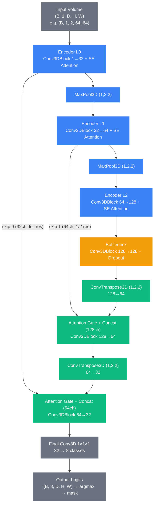
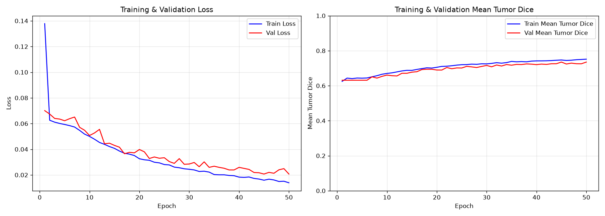
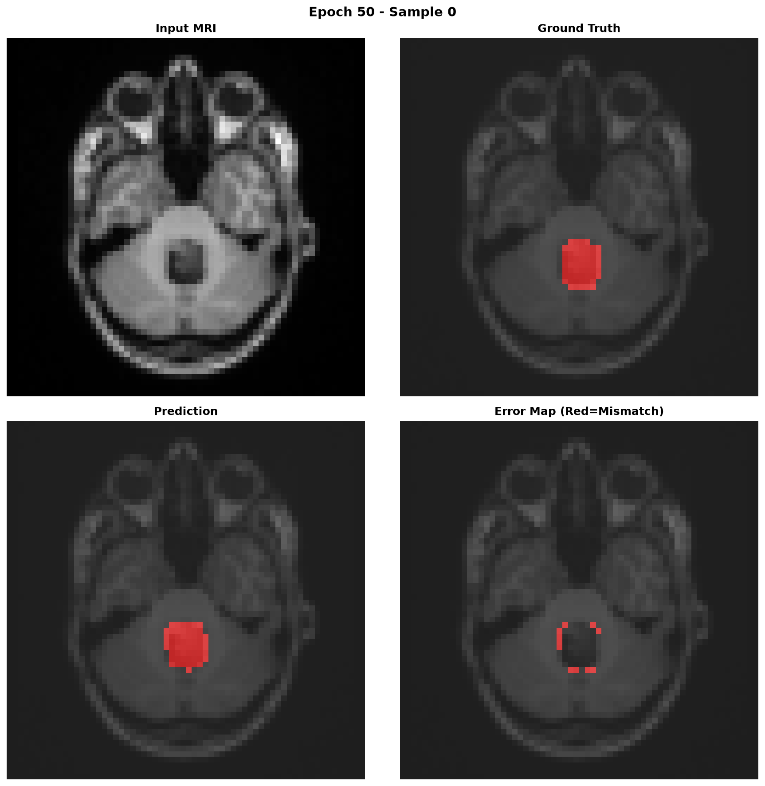
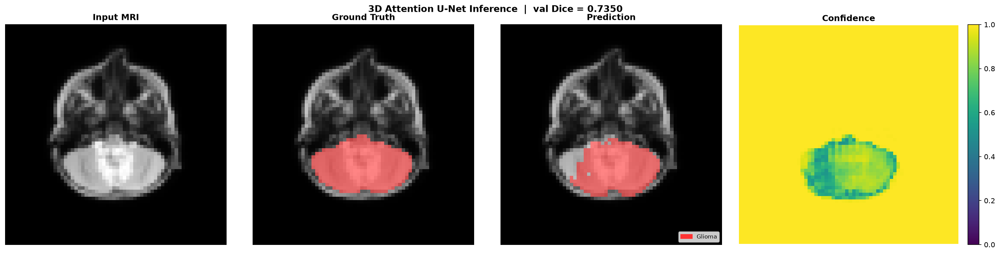
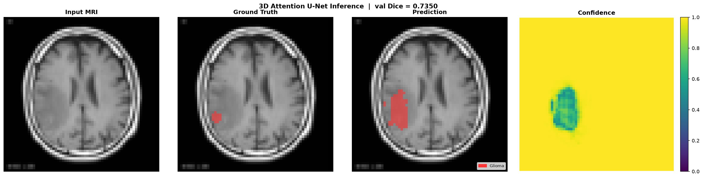
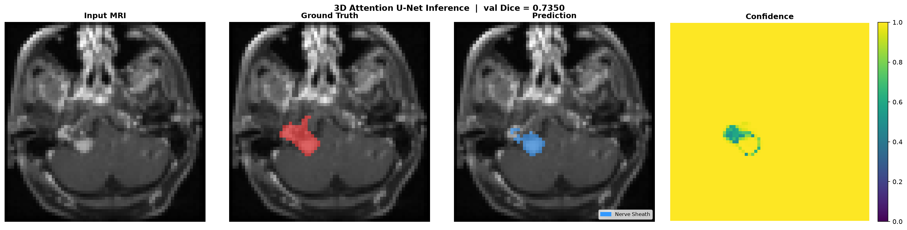
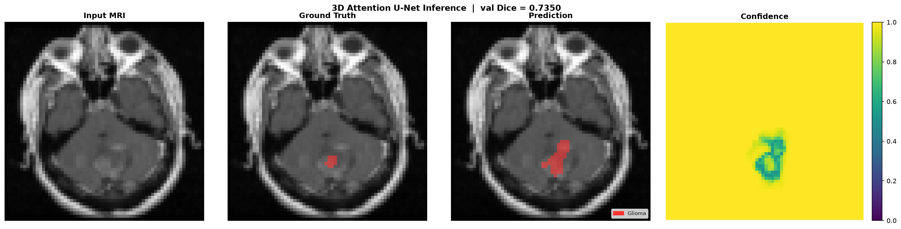
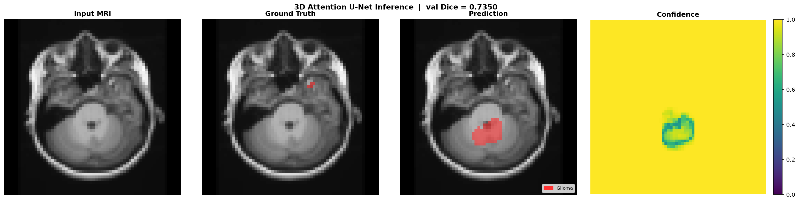
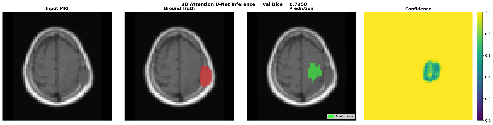
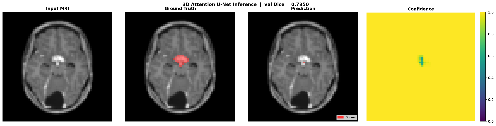

# Brain Tumor Segmentation — 3D Attention U-Net

> 8-class brain tumor segmentation from MRI using 3D Attention U-Net — classifies 7 WHO tumor categories + background from 12K+ real clinical scans.

[](https://python.org)
[](https://pytorch.org)
[](LICENSE)
[](https://github.com/motazalqaoud)

---

## What is this about?

This project implements a **clinical-grade pipeline for brain tumor segmentation from MRI**, covering the full stack from raw DICOM/NIfTI loading through 3D volumetric training to multi-class prediction.

**Key capabilities:**
- 8-class segmentation: Glioma, Meningioma, Nerve Sheath, Embryonic, Mixed Neuronal, Mesenchymal, Germ Cell + Background
- Weakly-supervised training on 12,391 real MRI scans — T1, T1C+, T2 modalities, all loaded
- 3D Attention U-Net (2.2M params) with SE channel attention + spatial attention gates
- Hybrid loss (Weighted Dice + Focal + Boundary) with per-class weights for severe imbalance
- Per-class Mean Tumor Dice tracked for all 7 WHO tumor categories during training and evaluation

Every engineering decision is driven by clinical requirements — voxel spacing, orientation metadata, and correct intensity handling are treated as first-class concerns, not afterthoughts.

---

## Repository Structure

```
Brain-Tumor-Segmentation/
│
├── notebooks/
│   ├── 01_load_visualize_medical_images.ipynb   # DICOM & NIfTI loading, 3D viz
│   ├── 02_preprocessing_pipeline.ipynb          # Normalization, augmentation, resampling
│   └── 03_tumor_segmentation_unet.ipynb         # U-Net from scratch for lesion segmentation
│
├── src/
│   ├── preprocessing/
│   │   ├── dicom_loader.py          # DICOM stack → numpy/tensor
│   │   ├── nifti_loader.py          # NIfTI loader with metadata & affine
│   │   ├── transforms.py            # Anatomy-aware augmentations
│   │   └── brain_tumor_loader.py    # Kaggle brain tumor dataset loader
│   ├── segmentation/
│   │   ├── unet.py                  # 2D U-Net architecture
│   │   ├── losses.py                # Dice, BCE+Dice, Focal losses
│   │   ├── unet3d.py                # 3D Attention U-Net (channel + spatial attention)
│   │   └── losses_advanced.py       # Weighted Dice, Focal, Boundary, Hybrid loss
│   └── visualization/
│       ├── viewer.py                # 3-plane viewer (axial/sagittal/coronal)
│       └── visualizer3d.py          # Segmentation comparison & training curve plots
│
├── scripts/
│   ├── train.py                     # Train 2D U-Net on Kaggle dataset (simpler entry point)
│   ├── train3d.py                   # Train 3D Attention U-Net on Kaggle dataset
│   ├── predict.py                   # 2D U-Net inference on a real MRI image
│   ├── predict3d.py                 # 3D Attention U-Net inference with confidence map
│   └── test_model.py                # End-to-end verification (dataset → model → viz)
│
├── configs/
│   ├── cpu.json                     # CPU training preset (measured: ~43 min/epoch, 8-class, all modalities)
│   ├── gpu_8gb.json                 # 8GB GPU preset (estimated ~2 min/epoch)
│   ├── gpu_16gb.json                # 16GB+ GPU preset (estimated ~45 sec/epoch)
│   └── hypertune.json               # Hyperparameter tuning starting point
│
├── data/
│   ├── README.md                    # How to get the datasets
│   └── samples/                     # Synthetic NIfTI pairs (Option A)
│
├── docs/
│   └── design_decisions.md       # Why standard DL assumptions break on MRI data
│
├── run.py                           # Single entry point: setup / train / predict / results
├── pyproject.toml
├── requirements.txt
└── README.md
```

---

## Quickstart

```bash
git clone https://github.com/motazalqaoud/Brain-Tumor-Segmentation.git
cd Brain-Tumor-Segmentation
pip install -r requirements.txt
```

### Step 1 — Setup (download dataset, verify everything)

```bash
python run.py setup
```

This will walk you through the Kaggle API key, download the 12K brain tumor dataset, and verify the model loads correctly. [Full dataset instructions →](data/README.md)

### Step 2 — Train

```bash
python run.py train
```

Hardware is auto-detected. CPU, 8GB GPU, and 16GB GPU each get appropriate settings automatically. You'll see an estimated training time before it starts and can confirm or cancel.

### Step 3 — Run inference

```bash
# Auto-picks best checkpoint and a real image from the dataset:
python run.py predict

# Or specify your own image + ground truth mask:
python run.py predict --image path/to/image.jpg --mask path/to/mask.png
```

Saves `prediction.png` — a 4-panel figure: input MRI / ground truth / prediction (colour-coded per class) / confidence map.

### Step 4 — Generate all results

```bash
python run.py results
```

Runs inference on one sample per tumor type (all 7 WHO categories), copies training curves, and saves everything to `results/`.

---

## CUDA Setup (GPU Training)

Training on a GPU is 3–10× faster than CPU. If you have an NVIDIA GPU, follow these steps before running `pip install -r requirements.txt`.

### Step 1 — Install NVIDIA drivers

- **Windows:** [nvidia.com/drivers](https://www.nvidia.com/drivers) → select your GPU → download and install
- **Linux (Ubuntu):** `sudo apt install nvidia-driver-535` (or latest available), then reboot

Verify: `nvidia-smi` — you should see your GPU name and driver version.

### Step 2 — Install CUDA Toolkit

Download from [developer.nvidia.com/cuda-downloads](https://developer.nvidia.com/cuda-downloads).  
Select your OS → Architecture → Version. Recommended: **CUDA 12.1**.

Verify: `nvcc --version`

### Step 3 — Install PyTorch with CUDA

Replace the PyTorch line in `requirements.txt` is not needed — instead run:

```bash
pip install torch torchvision torchaudio --index-url https://download.pytorch.org/whl/cu121
pip install -r requirements.txt
```

Verify CUDA is available in Python:

```python
import torch
print(torch.cuda.is_available())      # True
print(torch.cuda.get_device_name(0))  # Your GPU name
```

### CUDA not available?

`run.py train` and `train3d.py` will **automatically fall back to CPU** if CUDA is not detected. Training will be slower but will work. Use `configs/cpu.json` for appropriate settings.

---

## Advanced Usage

### Pick your hardware manually

| Config | Hardware | Approx. time/epoch |
|---|---|---|
| `configs/cpu.json` | No GPU | ~43 min (measured) |
| `configs/gpu_8gb.json` | RTX 3070 / 4060 Ti | ~2 min (estimated) |
| `configs/gpu_16gb.json` | RTX 3090 / 4090 / A100 | ~45 sec (estimated) |

```bash
python scripts/train3d.py --config configs/gpu_8gb.json --data-root data/raw/Images_
```

### Resume after interruption

Every epoch saves `checkpoints/checkpoint_latest.pt` automatically.

```bash
python run.py train --resume checkpoints/checkpoint_latest.pt
```

### Hyperparameter tuning

Edit `configs/hypertune.json` — it contains a `_tuning_guide` section explaining what each parameter affects and suggested search ranges. Then train with it:

```bash
python scripts/train3d.py --config configs/hypertune.json --data-root data/raw/Images_
```

Key parameters to tune:

| Parameter | Effect | Try |
|---|---|---|
| `lr` | Learning rate | `1e-4`, `5e-4`, `1e-3`, `3e-3` |
| `batch` | Gradient stability | `4`, `8`, `16` |
| `base-filters` | Model capacity | `16`, `32`, `64` |
| `depth` | Receptive field | `2`, `3`, `4` |
| `image-size` | Spatial resolution | `64`, `96`, `128` |

### Inference with full control

```bash
python scripts/predict3d.py \
    --checkpoint checkpoints/best_model_dice_0.7350.pt \
    --image "data/raw/Images_/Images_/Gliomas/Gliomas T1C+/Astrocytoma T1C+/image.jpg" \
    --mask  "data/raw/Images_/Images_/Gliomas/Gliomas T1C+/Astrocytoma T1C+/image_mask_consensus.png" \
    --out   my_result.png
```

---

## Models

### 2D U-Net (`src/segmentation/unet.py`)

Classic U-Net for slice-level binary tumor segmentation.

```python
from src.segmentation import UNet

model = UNet(in_channels=1, n_classes=1, base_filters=32, depth=4)
# Input: (B, 1, H, W)  →  Output: (B, 1, H, W) logits
```

### 3D Attention U-Net (`src/segmentation/unet3d.py`)

Volumetric model with channel attention (SE blocks) and spatial attention gates.
Supports multi-class output for WHO tumor classification.

```python
from src.segmentation import AttentionUNet3D

model = AttentionUNet3D(in_channels=1, num_classes=8, base_filters=32, depth=4)
# Input: (B, 1, D, H, W)  →  Output: (B, 8, D, H, W) logits
# Classes: 0=background, 1=glioma, 2=meningioma, 3=nerve sheath,
#          4=embryonic, 5=mixed neuronal, 6=mesenchymal, 7=germ cell
```

#### Architecture (as trained — `depth=2, base_filters=32`, `configs/cpu.json`)



Pooling and upsampling only touch H and W (`kernel=(1,2,2)`) — the depth axis is preserved throughout, since pseudo-3D inputs have very small `D` (2–8 frames) that real `(2,2,2)` pooling would collapse. Each `Conv3DBlock` includes a residual connection and squeeze-and-excitation channel attention; each decoder skip connection passes through an attention gate before concatenation. Full block-level diagrams (SE attention, attention gate internals) are on the [Model Architecture wiki page](https://github.com/motazalqaoud/Brain-Tumor-Segmentation/wiki/Model-Architecture).

---

## Loss Functions

| Loss | Module | Use case |
|---|---|---|
| `DiceLoss` | `losses.py` | Binary segmentation |
| `BCEDiceLoss` | `losses.py` | Binary, faster convergence |
| `FocalLoss` | `losses.py` | Very small lesions |
| `WeightedDiceLoss` | `losses_advanced.py` | Multi-class with imbalance |
| `HybridLoss` | `losses_advanced.py` | Multi-class (Dice + Focal + Boundary) |

---

## Notebooks

### 1. Load & Visualize Brain MRI
`notebooks/01_load_visualize_medical_images.ipynb`

- Load Kaggle brain tumor MRI dataset (12K+ images)
- Visualize T1/T2 weighted scans with tumor overlays
- Extract and inspect bounding boxes and segmentation masks

### 2. Preprocessing Pipeline for Brain MRI
`notebooks/02_preprocessing_pipeline.ipynb`

- Intensity normalization for T1/T2 weighted images
- Skull stripping and registration
- Anatomy-aware augmentation (small rotations, no random flips)

### 3. Brain Tumor Segmentation with U-Net
`notebooks/03_tumor_segmentation_unet.ipynb`

- Train 2D U-Net on brain MRI images with ground truth masks
- Multi-class segmentation (8 WHO tumor categories)
- Evaluate with per-class Dice and volumetric metrics

---

## Results

Trained for 50 epochs on CPU using the full Kaggle Brain Tumor 12K dataset (8,673 train / 1,858 val / 1,860 test), all modalities (T1, T1C+, T2).

### Training Configuration

| Parameter | Value |
|---|---|
| Model | 3D Attention U-Net |
| Parameters | 2.2M |
| Base filters | 32 |
| Depth | 2 |
| Image size | 64×64 |
| D-frames (pseudo-3D) | 2 |
| Epochs | 50 |
| Batch size | 4 |
| Optimizer | Adam, lr=1e-3 |
| Scheduler | ReduceLROnPlateau (factor=0.5, patience=5) |
| Loss | HybridLoss (α=0.5 Dice, β=0.3 Focal, γ=0.2 Boundary) |
| Classes | 8 (background + 7 WHO tumor categories) |
| Dataset split | 70% train / 15% val / 15% test |
| Hardware | CPU (~43 min/epoch, ~36 hours total) |

### Test Set Metrics (1,860 held-out images)

| Class | Test Dice |
|---|---|
| **Mean Tumor Dice** | **0.7387** |
| Background | 0.9917 |
| Glioma | 0.4713 |
| Meningioma | 0.6927 |
| Nerve Sheath | 0.8077 |
| Embryonic | 0.7535 |
| Mixed Neuronal | 0.7391 |
| Mesenchymal | 0.7786 |
| Germ Cell | 0.9278 |

Glioma scores lowest — expected, since gliomas are the most morphologically heterogeneous tumor category (varying grade, shape, and infiltration pattern), while Germ Cell and Nerve Sheath tumors tend to have more consistent, well-circumscribed shapes.

### Training Curves



Val Mean Tumor Dice climbs from 0.63 → 0.74 over 50 epochs with the train/val gap staying small throughout — no significant overfitting.

### Validation Sample



### Inference on Unseen Images

| Glioma | Meningioma | Nerve Sheath | Embryonic |
|---|---|---|---|
|  |  |  |  |

| Mixed Neuronal | Mesenchymal | Germ Cell |
|---|---|---|
|  |  |  |

Output from `predict3d.py`: input MRI / tumor prediction overlay / confidence map (colour-coded per WHO class).

---

## Clinical Context

> Most medical AI tutorials miss the clinical reality. Here's what's different about this repo:

| Common Tutorial | This Repo |
|---|---|
| Random image flipping | Anatomy-aware augmentation (no random flips) |
| RGB normalization only | T1/T2 weighted intensity handling |
| Pixel accuracy only | Dice + Hausdorff + volumetric metrics |
| 2D slices only | 3D volumetric model with attention gates |
| Binary classifier | Multi-class segmentation (WHO tumor types) |
| Generic datasets | Brain tumor MRI (12K+ clinical images) |

See `docs/design_decisions.md` for the full explanation.

---

## Tech Stack

| Tool | Purpose |
|---|---|
| `pydicom` | DICOM file loading |
| `nibabel` | NIfTI file loading |
| `SimpleITK` | Resampling, registration |
| `PyTorch` | Deep learning (U-Net, 3D Attention U-Net) |
| `albumentations` | Image augmentation pipeline |
| `scikit-image` | Morphological ops and image processing |
| `matplotlib` | Visualization |
| `numpy` | Array operations |

---

## About the Author

**Motaz Alqaoud, PhD**

- PhD in Biomedical Engineering with focus on medical image analysis and deep learning
- Senior AI/ML Engineer specializing in medical imaging, segmentation models, and clinical AI systems
- GitHub: [@motazalqaoud](https://github.com/motazalqaoud)
- LinkedIn: [linkedin.com/in/motazalqaoud](https://linkedin.com/in/motazalqaoud)

---

## License

MIT License — use freely, attribution appreciated.

---

*Connect on [LinkedIn](https://linkedin.com/in/motazalqaoud) or open an issue for questions and collaboration.*
