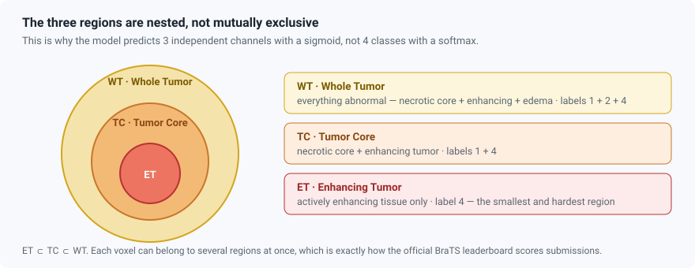
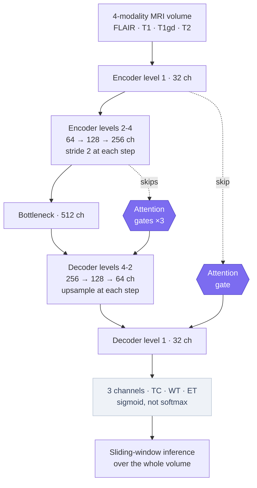
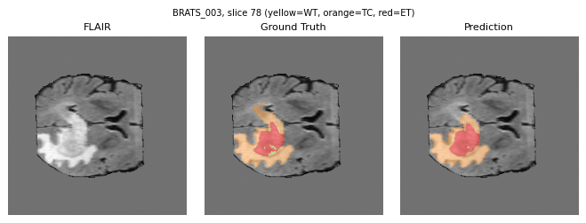

# Brain Tumor Segmentation (3D)


Multi-class brain tumor segmentation from MRI. Give it a 4-modality NIfTI
scan (FLAIR, T1, T1-contrast, T2) and it segments the tumor into three
clinically standard regions: Tumor Core, Whole Tumor, and Enhancing
Tumor. The model works on the full 3D volume, not individual 2D slices.

## Dataset

Trained on the **Medical Segmentation Decathlon, Task01_BrainTumour**
set -- 750 4D MRI volumes (484 train / 266 test), sourced from the BraTS
2016/2017 challenge, with four co-registered modalities per subject
(FLAIR, T1w, T1gd, T2w). Publicly downloadable, no registration wall,
via MONAI's built-in downloader -- see Setup below.

| Region | Raw labels combined | Meaning |
|---|---|---|
| TC (Tumor Core) | necrotic core + enhancing tumor | 1 + 4 |
| WT (Whole Tumor) | everything abnormal: core + edema | 1 + 2 + 4 |
| ET (Enhancing Tumor) | actively enhancing tissue only | 4 |

These three regions are **nested, not mutually exclusive** (ET inside TC
inside WT), which is why this is a 3-channel multi-label problem rather
than a 4-class softmax problem -- this is also exactly how the official
BraTS leaderboard evaluates submissions.



Citation:
> Simpson, A. L. et al. A large annotated medical image dataset for the
> development and evaluation of segmentation algorithms. Medical
> Segmentation Decathlon (2019). http://medicaldecathlon.com/

**The dataset is not bundled in this repo** (~7GB compressed). See Setup.

## Design notes

A few choices worth calling out if you plan to build on this:

- **Real 3D, not slices.** Input and output are full (H, W, D) volumes,
  never a 2D slice stack.
- **Split by subject, not by image.** Each 4D file is one patient, so
  train/val splits never leak the same patient across sets.
- **Full-volume evaluation.** Sliding-window inference covers the entire
  scan at eval/inference time, since a model that only ever sees training
  patches still has to work on a whole clinical scan.
- **Two metrics, not one.** Dice and 95th-percentile Hausdorff distance --
  both official BraTS metrics.
- **GPU-memory-aware sizing.** Patch and batch size auto-adjust to the
  GPU actually available, instead of assuming a specific card.

## Architecture

**3D Attention U-Net** (MONAI AttentionUnet, spatial_dims=3), 4 input
channels (the 4 MRI modalities) to 3 output channels (TC/WT/ET), with
attention gates on each skip connection.

MONAI's SegResNet -- the architecture that won BraTS 2018 (Myronenko,
2018) -- is a well-documented, strong alternative worth trying on this
exact dataset; swapping src/model.py's build_model() to use it is a
small change if you want to compare both.


```mermaid
flowchart TB
    IN["4-modality MRI volume<br/>FLAIR · T1 · T1gd · T2"]
    IN --> E1

    E1["Encoder level 1 · 32 ch"] --> EM["Encoder levels 2-4<br/>64 → 128 → 256 ch<br/>stride 2 at each step"]
    EM --> BN["Bottleneck · 512 ch"]
    BN --> DM["Decoder levels 4-2<br/>256 → 128 → 64 ch<br/>upsample at each step"]
    DM --> D1["Decoder level 1 · 32 ch"]
    D1 --> OUT["3 channels · TC · WT · ET<br/>sigmoid, not softmax"]

    EM -. "skips" .-> AGM{{"Attention<br/>gates ×3"}}
    AGM --> DM
    E1 -. "skip" .-> AG1{{"Attention<br/>gate"}}
    AG1 --> D1

    OUT --> SW["Sliding-window inference<br/>over the whole volume"]

    style AG1 fill:#7c6cf0,color:#fff,stroke:#5548c8
    style AGM fill:#7c6cf0,color:#fff,stroke:#5548c8
    style OUT fill:#eef2f7,color:#33415c,stroke:#b8c4d4
```

The attention gates are what make this an *Attention* U-Net: rather than
concatenating each skip connection wholesale, the gate learns to suppress the
parts of the encoder feature map that are irrelevant to the region being
decoded -- useful here because tumour occupies a small fraction of any brain
volume, so most of each skip connection is background.

Training uses random patches for throughput, but validation and inference run
**sliding-window over the entire volume** -- a model that only ever sees
patches still has to work on a whole clinical scan.

## Repository structure

This repo contains two things: the current, real 3D pipeline (what the
rest of this README describes), and the original project this evolved
from, kept for reference and reproducibility.

```
Brain-Tumor-Segmentation/
app.py                 Gradio demo: NIfTI upload -> segmentation overlay
data_prep.py           Downloads Task01_BrainTumour (MONAI downloader)
requirements.txt, pyproject.toml
configs/               GPU/CPU training presets (cpu, gpu_8gb, gpu_16gb, hypertune)
data/                  Dataset download instructions (data not bundled)
docs/design_decisions.md   Why common deep-learning assumptions break on MRI data
slurm/train_job.slurm  SLURM batch script, for GPU clusters that use it

src/                   ** Current pipeline (this README) **
  dataset.py           Transforms: load, resample, crop, label conversion
  model.py             3D Attention U-Net, GPU-memory-aware sizing
  train.py             Training + full-volume sliding-window validation
  evaluate.py          Per-region Dice + Hausdorff distance on full volumes
  predict.py           Single-subject inference -> segmentation NIfTI

notebooks/             ** Original project (see below) **
  01_load_visualize_medical_images.ipynb
  02_preprocessing_pipeline.ipynb
  03_tumor_segmentation_unet.ipynb
scripts/               Original training/inference entry points (2D/pseudo-3D)
src/preprocessing/     DICOM/NIfTI loaders and transforms used by the notebooks
src/segmentation/      Original U-Net + loss implementations (2D and pseudo-3D)
src/visualization/     Slice-overlay viewers used by the notebooks
results/               Example prediction image from the current model

checkpoints/           best_model.pth lands here after training (gitignored)
```

**About the two pipelines:** the `notebooks/`, `scripts/`,
`src/preprocessing/`, `src/segmentation/`, and `src/visualization/`
directories are from an earlier version of this project: an 8-class
tumor-type classifier (glioma, meningioma, nerve sheath, etc.) trained
on a different, 2D/pseudo-3D pipeline. They are kept for reference.
Everything else in this README -- the Decathlon TC/WT/ET segmentation
model, its training, and its results, including the example image in
`results/` -- describes the current pipeline, in `src/dataset.py`,
`model.py`, `train.py`, `evaluate.py`, and `predict.py`.

## Pretrained weights

You don't have to train this yourself. The checkpoint behind the numbers in the
Results section is published:

- **Hugging Face:** [`motazalqaoud/brain-tumor-segmentation-weights`](https://huggingface.co/motazalqaoud/brain-tumor-segmentation-weights)
- **GitHub Release:** attached to [v2.1.0](https://github.com/motazalqaoud/Brain-Tumor-Segmentation/releases/tag/v2.1.0)

`best_model.pth` is 90.2 MB (3D Attention U-Net, 23,634,533 parameters, trained
100 epochs, validation mean Dice 0.8031).

```python
from huggingface_hub import hf_hub_download
import torch

path = hf_hub_download("motazalqaoud/brain-tumor-segmentation-weights", "best_model.pth")
ckpt = torch.load(path, map_location="cpu")

# weights live under "model_state_dict", alongside epoch and val_dice_per_region
state_dict = ckpt["model_state_dict"]
```

Drop it at `checkpoints/best_model.pth` and the evaluation, inference and demo
commands below work immediately. Model card, a download CLI and a checkpoint
verifier live in
[open-source-model-weights](https://github.com/motazalqaoud/open-source-model-weights).

> Note: the assets on the older `v1.0.0` and `v2.0.0` releases come from
> earlier, different pipelines (an 8-class WHO tumor-type model, and an earlier
> segmentation run). They do **not** correspond to the results above -- use
> `v2.1.0` or the Hugging Face copy.

## Setup

```bash
git clone https://github.com/motazalqaoud/Brain-Tumor-Segmentation
cd Brain-Tumor-Segmentation
pip install -r requirements.txt
```

Download the dataset (handled automatically -- ~7GB, needs internet access):

```bash
python data_prep.py --root_dir ./data
```

This creates ./data/Task01_BrainTumour/ with imagesTr/ (484 4D volumes)
and labelsTr/ (matching masks).

## Training

```bash
python src/train.py --data_dir ./data/Task01_BrainTumour --epochs 150
```

Needs a GPU with at least 8-16GB VRAM for a real run; patch size and
batch size auto-detect from whatever GPU is available (see dataset.py's
recommend_patch_and_batch_size), so it will not crash from running out
of memory partway through a multi-hour job -- override with
--patch_size/--batch_size once you know your GPU and want to tune for
throughput instead of safety. A CPU can verify the pipeline runs (tiny
patch size, a couple of epochs), but a full run needs a GPU.

If you have access to a SLURM-managed GPU cluster, `slurm/train_job.slurm`
is a ready-to-edit batch script; submit with `sbatch slurm/train_job.slurm`
after editing the module names and paths to match your cluster.

Training uses mixed precision (AMP), Dice loss (sigmoid, per nested
region), cosine LR annealing, and checkpoints the best model by mean
validation Dice across all three regions. Full-volume validation via
sliding-window inference runs every --val_interval epochs (default 5).

## Evaluation

```bash
python src/evaluate.py --data_dir ./data/Task01_BrainTumour --checkpoint checkpoints/best_model.pth
```

Reports, on full held-out volumes (sliding-window inference, not
patches): per-region Dice (TC, WT, ET) and mean, plus per-region
95th-percentile Hausdorff distance (HD95, mm) -- the two standard
BraTS leaderboard metrics.

## Inference on a new scan

```bash
python src/predict.py --image path/to/subject_4mod.nii.gz \
    --checkpoint checkpoints/best_model.pth --output segmentation.nii.gz
```

Produces a segmentation NIfTI you can load in 3D Slicer, ITK-SNAP, or
any NIfTI viewer alongside the original scan. Expects a single 4D
NIfTI (H, W, D, 4) in the MSD layout; if your modalities are four
separate files, stack them first (see the docstring in predict.py).

## Running the demo locally

```bash
python app.py
```

If checkpoints/best_model.pth does not exist yet, the app runs in a
clearly-labeled demo mode: the full 3D pipeline runs for real, but the
network is untrained, so the segmentation shown is not meaningful.
Train first and the app auto-detects the checkpoint.

## Results



*FLAIR slice (left), ground truth (center), and this model's prediction (right) for a held-out subject. Yellow = Whole Tumor, orange = Tumor Core, red = Enhancing Tumor.*

Full sliding-window inference on held-out volumes, using the two official
BraTS metrics:

| Region | Dice | HD95 (mm) |
|---|---|---|
| TC | 0.7915 | 14.18 |
| WT | 0.8712 | 15.80 |
| ET | 0.7582 | 7.53 |
| **Mean** | **0.8069** | -- |

Full sliding-window evaluation on held-out volumes via src/evaluate.py.

For rough context, published results on similar architectures and this
dataset family often land around Dice 0.85-0.90 for WT, 0.80-0.85 for TC,
0.70-0.80 for ET -- ET is consistently the hardest region across the
field, since it is the smallest of the three regions. These are
literature ranges from heavily-tuned, ensembled pipelines, not a
promise about what this single-model, single-GPU checkpoint will hit.

## Limitations and disclaimer

**This is a research and portfolio project, not a medical device.** Not
validated prospectively, not reviewed by a regulatory body, must never
be used to make or defer an actual diagnosis. BraTS-derived data comes
from a specific set of institutions and scanner protocols; a model
trained only on this data should not be assumed to generalize to
arbitrary clinical scanners without further validation. Any actual
diagnosis requires a radiologist and the full clinical picture.

## Tech stack

| Tool | Purpose |
|---|---|
| MONAI | Medical imaging transforms, 3D networks, sliding-window inference |
| PyTorch | Deep learning |
| nibabel | NIfTI I/O |
| Gradio | Interactive demo |
| matplotlib | Slice-overlay visualization |

## About the author

**Motaz Alqaoud, PhD**
- PhD in Biomedical Engineering, focus on medical image analysis and deep learning
- Senior AI/ML Engineer specializing in medical imaging, segmentation models, and clinical AI systems
- GitHub: [@motazalqaoud](https://github.com/motazalqaoud)
- LinkedIn: [linkedin.com/in/motazalqaoud](https://linkedin.com/in/motazalqaoud)

## License

MIT -- see [LICENSE](LICENSE).
